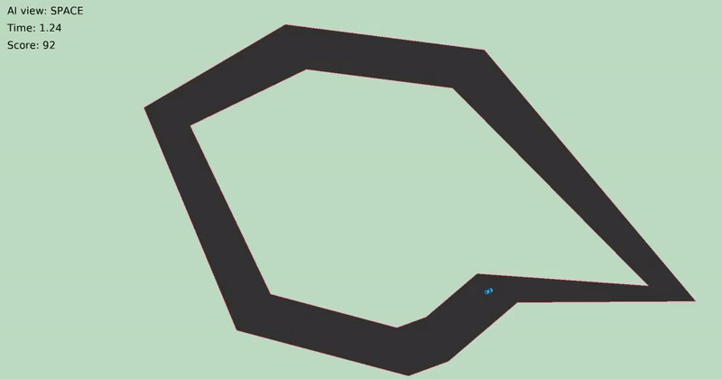

### initial-DQN

My own DQN framework for custom environments. Supports:  
- Custom environments with openai gym.  
- Dynamic save and load with msgpack.  
- Multi-processing learning.  
- Tensorboard visualization.  

The following algorithms are implemented:  
- DQN: vanilla DQN.  
- DDQN: Double DQN.  
- 3DQN: Dueling Double DQN.  
- Per3DQN: Dueling Double DQN with Priority Experience Replay.  

How to use:  
1. Create a custom environment in `env/` and tune its hyperparameters in `dqn/config/dqn_config.py` (`demo/`).  
2. Train the model with `python3 train.py -algo PerDuelingDoubleDQNAgent -max_total_steps 10000000`.  
3. Observe with `python3 observe.py -dir save/PerDuelingDoubleDQNAgent_lr0.0001_model.pack -max_steps 0`.  
4. Visualize the learning curves in tensorboard with `tensorboard --logdir ./logs/`.  
5. And beat the AI with `python3 play.py` to assert dominance on the machines.  

See `demo/` for a complete guide on how to use bin scripts, build a custom environment and run the programs.  

****

### Software Requirements

- Python 3.7  
> sudo apt-get update && sudo apt-get install build-essential libpq-dev libssl-dev openssl libffi-dev sqlite3 libsqlite3-dev libbz2-dev zlib1g-dev cmake python3.7 python3-pip python3.7-dev python3.7-venv  

- venv  
> mkdir venv && python3.7 -m venv venv/  
> source venv/bin/activate  
> deactivate  

- pyglet, gym, torch, tensorboard, msgpack, wheel  
> (venv) pip3 install 'pyglet==1.5.0' gym torch tensorboard 'msgpack==1.0.2' wheel --no-cache-dir  

****

### Custom environments with frameworkQ

- initial-DQN: https://github.com/romainducrocq/initial-DQN  

 

- flappy-seamonkai: https://github.com/romainducrocq/flappy-seamonkai  

****

@rd
